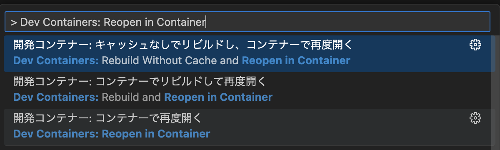

# LuaLaTeX-Docker-VSCode
A sample repository for using LuaLaTeX with Docker and VSCode

## Usage
1. Clone this repository
```sh
git clone https://github.com/Yuki-Imajuku/LuaLaTeX-Docker-VSCode.git
```

2. `Dev Containers: Reopen in Container` on VSCode


3. Save (Command / Control + S) the `main.tex` in the container

## Reference
[James-Yu/LaTeX-Workshop GitHub repo](https://github.com/James-Yu/LaTeX-Workshop/wiki/Install#using-docker)
